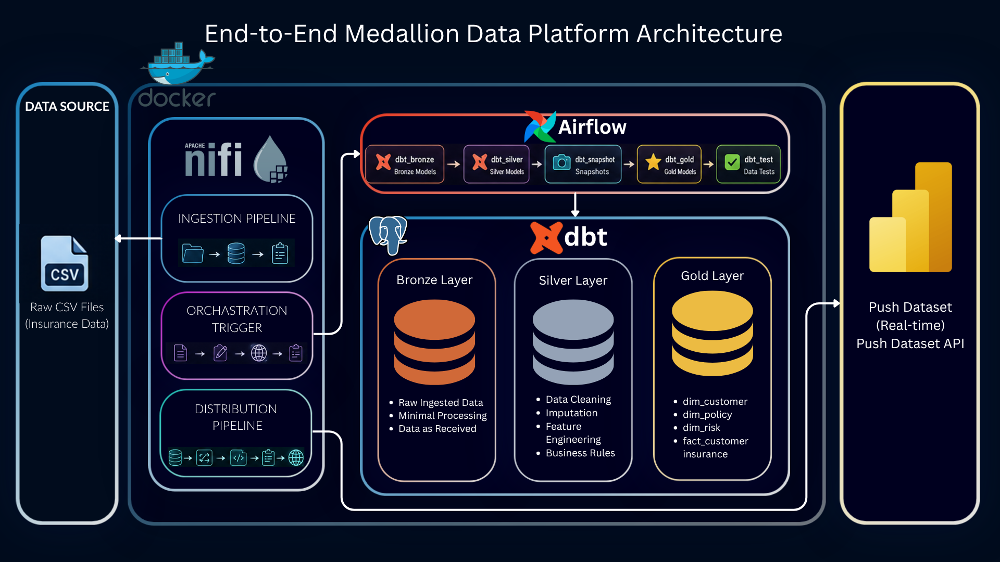

# End-to-End Medallion Data Platform

A complete modern data engineering pipeline that ingests raw insurance data, transforms it through Bronze → Silver → Gold layers, orchestrates transformations with Airflow, and pushes final analytics to Power BI in real time.



---

## Table of Contents

- [Architecture Overview](#architecture-overview)
- [Project Structure](#project-structure)
- [Medallion Layers](#medallion-layers)
- [Components](#components)
  - [NiFi — Ingestion & Distribution](#1-nifi--ingestion--distribution)
  - [dbt — Transformation](#2-dbt--transformation)
  - [Airflow — Orchestration](#3-airflow--orchestration)
  - [EDA — Data Profiling](#4-eda--data-profiling)
- [Getting Started](#getting-started)

---

## Architecture Overview

```
CSV Files
    │
    ▼
NiFi (Ingestion)
    │  GetFile → PutDatabaseRecord
    ▼
PostgreSQL — Bronze Layer (raw)
    │
    ▼
Airflow (triggers dbt DAG)
    │
    ▼
dbt — Silver Layer (cleaned & enriched)
    │
    ▼
dbt — Gold Layer (star schema, KPIs)
    │
    ▼
NiFi (Distribution)
    │  ExecuteSQL → ConvertRecord → InvokeHTTP
    ▼
Power BI (real-time push via Push Dataset API)
```

---

## Project Structure

```
project-root/
│
├── nifi/
│   ├── ingestion/              # CSV → PostgreSQL Bronze pipeline
│   │   └── readme.md
│   ├── trigger-Airflow/        # NiFi → Airflow REST trigger pipeline
│   │   └── readme.md
│   ├── NiFi_PowerBI/           # Gold data → Power BI push pipeline
│   │   └── README.md
│   └── screenshots/            # Flow screenshots
│
├── dbt/
│   └── warehouse/              # dbt project (Bronze → Silver → Gold models)
│       └── README.md
│
├── dags/
│   ├── dbt_pipeline.py         # Airflow DAG definition
│   └── readme.md
│
├── data_profiling/             # EDA notebooks and reports
│   └── readme.md
│
├── imgs/                       # Architecture and output screenshots
└── README.md                   # You are here
```

---

## Medallion Layers

| Layer | Storage | Managed by | Contents |
|---|---|---|---|
| **Bronze** | `insurance_dw.bronze.insurance_data` | NiFi | Raw CSV data, no transformations |
| **Silver** | `insurance_dw.silver.*` | dbt | Cleaned, typed, feature-engineered data |
| **Gold** | `insurance_dw.gold.*` | dbt | Star schema — dimensions + fact table |

---

## Components

### 1. NiFi — Ingestion & Distribution

NiFi acts as the central data movement hub with three independent pipelines.

#### 1.1 CSV Ingestion → Bronze

```
GetFile → PutDatabaseRecord → LogAttribute
```

Ingests raw insurance CSV files into the PostgreSQL Bronze layer using schema inference via `CSVReader`. Handles batch inserts automatically.

- **Output table:** `insurance_dw.bronze.insurance_data`

→ See [`nifi/ingestion/readme.md`](nifi/ingestion/readme.md)

---

#### 1.2 Airflow Trigger

```
GenerateFlowFile → UpdateAttribute → InvokeHTTP → LogAttribute
```

Triggers Airflow DAGs via the Airflow REST API, enabling NiFi to kick off the dbt transformation pipeline automatically after ingestion. Runs every **1 minute**.

→ See [`nifi/trigger-Airflow/readme.md`](nifi/trigger-Airflow/readme.md)

---

#### 1.3 Gold → Power BI Push

```
ExecuteSQL → ConvertRecord → ReplaceText → UpdateAttribute → InvokeHTTP → LogAttribute
```

Reads final Gold-layer data from PostgreSQL and pushes it to Power BI using the **Push Dataset API** — no manual refresh or scheduled import needed.

→ See [`nifi/NiFi_PowerBI/README.md`](nifi/NiFi_PowerBI/README.md)

---

### 2. dbt — Transformation

dbt transforms raw Bronze data into analytics-ready Gold models following the Medallion Architecture.

#### Models

**Bronze** — basic cleaning, type casting, null validation applied to raw ingested data.

**Silver** — business transformations and feature engineering:
- Risk category classification
- Income segmentation
- Lifestyle profiling

**Gold** — star schema for analytics:

| Table | Type |
|---|---|
| `dim_customer` | Dimension |
| `dim_policy` | Dimension |
| `dim_risk` | Dimension |
| `fact_customer_insurance` | Fact |

→ See [`dbt/warehouse/README.md`](dbt/warehouse/readme.md)

---

### 3. Airflow — Orchestration

Airflow schedules and orchestrates the dbt transformation pipeline via a DAG that enforces task dependency order.

#### DAG Flow

```
dbt_bronze → dbt_silver → dbt_snapshot → dbt_gold → dbt_test
```

| Task | Description |
|---|---|
| `dbt_bronze` | Raw data cleaning |
| `dbt_silver` | Feature engineering & transformations |
| `dbt_snapshot` | SCD (Slowly Changing Dimension) tracking |
| `dbt_gold` | Analytics model generation |
| `dbt_test` | Data quality validation |

→ See [`dags/readme.md`](dags/readme.md)

---

### 4. EDA — Data Profiling

Validates data quality at every layer of the pipeline.

| Layer | Checks |
|---|---|
| **Raw** | Schema validation, null checks, duplicate detection |
| **Bronze** | Invalid value detection, distribution analysis |
| **Silver** | Feature validation, segmentation verification |
| **Gold** | KPIs, revenue insights, customer analytics |

→ See [`data_profiling/readme.md`](data_profiling/readme.md)

---

## Getting Started

### Prerequisites

- Docker & Docker Compose
- Apache NiFi
- PostgreSQL
- Python 3.8+ with dbt installed (`pip install dbt-postgres`)

### Setup

```bash
# 1. Clone
git clone <repository-url>
cd project-root

# 2. Start PostgreSQL
docker compose up -d postgres

# 3. Install dbt dependencies
cd dbt/warehouse
dbt deps

# 4. Run dbt manually (or let Airflow handle it)
dbt run --select bronze
dbt run --select silver
dbt run --select gold
dbt test

# 5. Start NiFi and deploy the three pipelines
# See nifi/ingestion/readme.md for setup steps
```

### Pipeline Execution Order

```
1. Start NiFi ingestion pipeline  →  Bronze data loaded
2. NiFi triggers Airflow DAG      →  Silver & Gold built by dbt
3. NiFi pushes Gold to Power BI   →  Dashboard updates in real time
```
