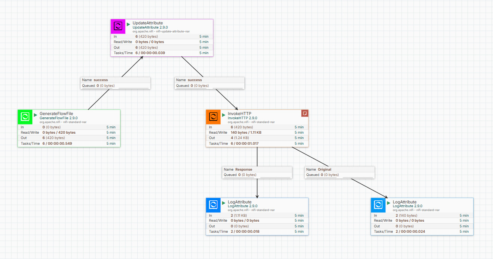
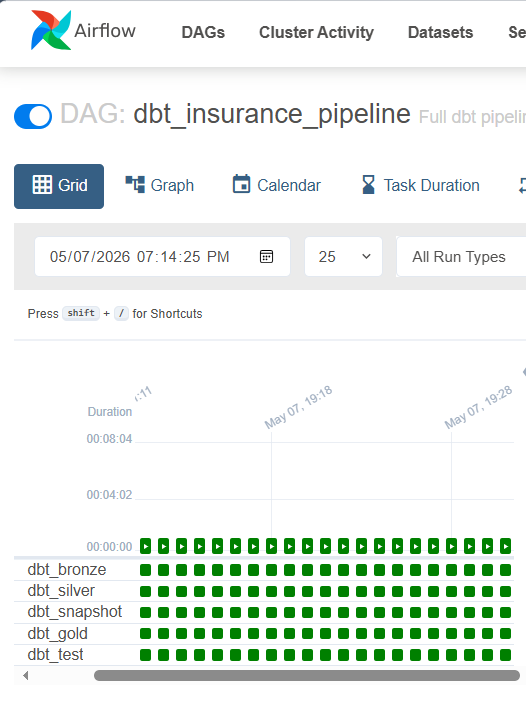
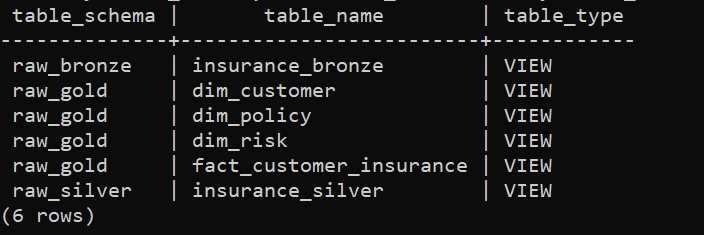
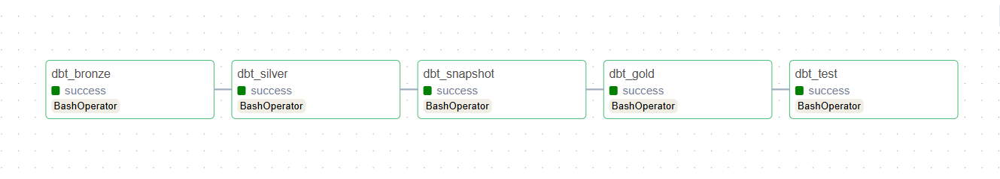

# End-to-End Medallion Data Platform (NiFi + Airflow + dbt + Power BI)
 
---
 


---

## Overview

This project implements a complete **end-to-end modern data engineering pipeline** that integrates:

* **Apache NiFi** → Data ingestion + orchestration triggers + data distribution
* **dbt (Data Build Tool)** → Data transformation & analytics modeling
* **Apache Airflow** → Workflow orchestration for dbt pipelines
* **PostgreSQL** → Data warehouse storage (Medallion Architecture)
* **Power BI (Push Dataset API)** → Real-time dashboard updates

---

## High-Level Architecture

```
CSV Files
   ↓
NiFi (Ingestion Layer)
   ↓
PostgreSQL Bronze Layer
   ↓
dbt (Silver → Gold Transformation)
   ↓
Airflow (Orchestration of dbt)
   ↓
NiFi (Trigger + Distribution Layer)
   ↓
Power BI (Real-time Dashboard via Push API)
```

---

# 1. NiFi Layer (Core Integration Engine)

NiFi acts as the **central data movement and automation hub** in this system.

It is responsible for:

* Data ingestion into PostgreSQL (Bronze layer)
* Triggering Airflow DAGs via REST API
* Pushing final curated data to Power BI

---

## 1.1 Data Ingestion Pipeline

### README Reference

👉 [`nifi/ingestion/readme.md`](nifi/ingestion/readme.md)

---

### Flow

```
GetFile → PutDatabaseRecord → LogAttribute
```

---

### Description

This pipeline ingests raw insurance CSV files into the **Bronze layer** of PostgreSQL.

It handles:

* File ingestion from local directory
* Schema inference using CSVReader
* Batch inserts into database

---

### Flow Visualization


---

### Output

* Database: `insurance_dw`
* Schema: `bronze`
* Table: `insurance_data`

---

## 1.2 NiFi → Airflow Trigger Pipeline

### README Reference

👉 [`nifi/trigger-Airflow/readme.md`](nifi/trigger-Airflow/readme.md)

---

### Flow

```
GenerateFlowFile → UpdateAttribute → InvokeHTTP → LogAttribute
```

---

### Description

This pipeline enables NiFi to **trigger Airflow DAGs programmatically** using REST API.

It simulates real-time orchestration where:

* NiFi initiates execution
* Airflow handles transformation workflows

---

### Execution Flow





---

### ⏱ Schedule

* DAG runs every **1 minute**
* Enables near real-time pipeline orchestration

---

## 1.3 Data Distribution (NiFi → Power BI)

### README Reference

👉 [`nifi/NiFi_PowerBI/README.md`](nifi/NiFi_PowerBI/README.md)

---

### Flow

```
ExecuteSQL → ConvertRecord → ReplaceText → UpdateAttribute → InvokeHTTP → LogAttribute
```

---

### Description

This pipeline extracts **final gold-layer data** and pushes it directly into Power BI using the **Push Dataset API**.

It removes the need for:

* Manual refresh
* Scheduled Power BI imports

---

### Pipeline Architecture


---

### Dashboard Output


---

### Key Value

* Real-time dashboard updates
* API-based automation
* Fully hands-free reporting system

---

# 2. dbt Layer (Data Transformation Engine)

### README Reference

👉 [`dbt/warehouse/README.md`](dbt/warehouse/README.md)

---

## Overview

dbt is responsible for transforming raw ingested data into structured analytics models.

It follows a **Medallion Architecture**:

```
Bronze → Silver → Gold
```

---

## Data Layers

### 🟤 Bronze Layer

* Raw structured data from NiFi
* Basic cleaning
* Type casting + validation

---

### ⚪ Silver Layer

* Business transformations
* Feature engineering:

  * risk categories
  * income segmentation
  * lifestyle profiling

---

### 🟡 Gold Layer

* Final analytics models
* Star schema design:

  * Dim Customer
  * Dim Policy
  * Dim Risk
  * Fact Insurance

---

## Analytics Outputs

### Customer Risk Distribution


---

### LTV Analysis


---

### Data Quality Impact


---

## Key Output Tables

* `dim_customer`
* `dim_policy`
* `dim_risk`
* `fact_customer_insurance`

---

# 3. EDA Layer (Exploratory Data Analysis)

### README Reference

👉 [`eda/README.md`](data_profiling\readme.md)

---

## Purpose

This layer validates data quality across all stages:

* Raw validation
* Bronze profiling
* Silver transformation analysis
* Gold business insights

---

## Layered Analysis

### Raw Layer

* schema validation
* null checks
* duplicates

### Bronze Layer

* invalid values detection
* distribution analysis

### Silver Layer

* feature validation
* segmentation verification

### Gold Layer

* KPIs
* revenue insights
* customer analytics

---

## Database View



---

## Outcome

Ensures:

* Data integrity
* Transformation correctness
* Business readiness

---

# 4. Airflow Orchestration Layer

### README Reference

👉 [`airflow/dbt_pipeline.md`](dags/readme.md)

---

## Overview

Airflow orchestrates dbt transformations using a scheduled DAG.

---

## DAG Flow

```
Bronze → Silver → Snapshot → Gold → Tests
```

---

## DAG Visualization



---

## Task Breakdown

| Task         | Description      |
| ------------ | ---------------- |
| dbt_bronze   | raw cleaning     |
| dbt_silver   | transformations  |
| dbt_snapshot | SCD tracking     |
| dbt_gold     | analytics models |
| dbt_test     | validation       |

---

## Key Role

* Automates transformation pipeline
* Ensures dependency order
* Enables reproducibility

---
 
 