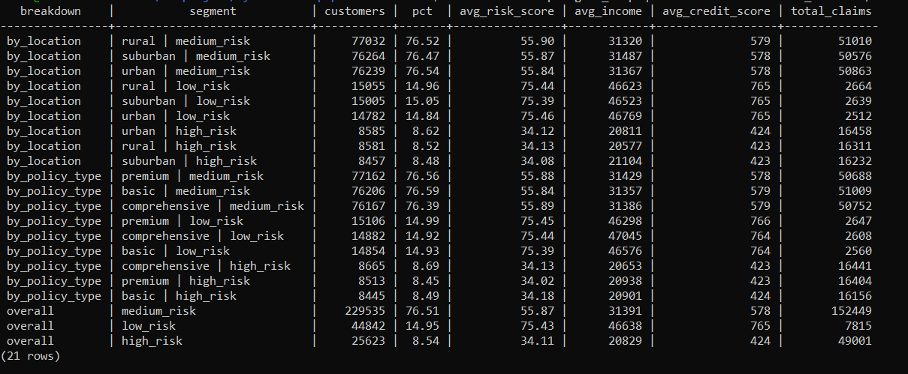
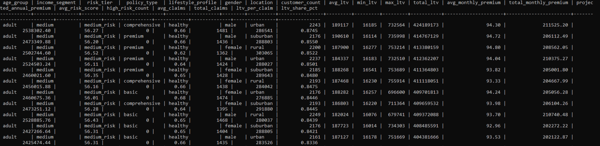
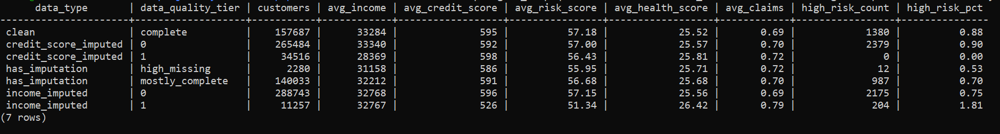
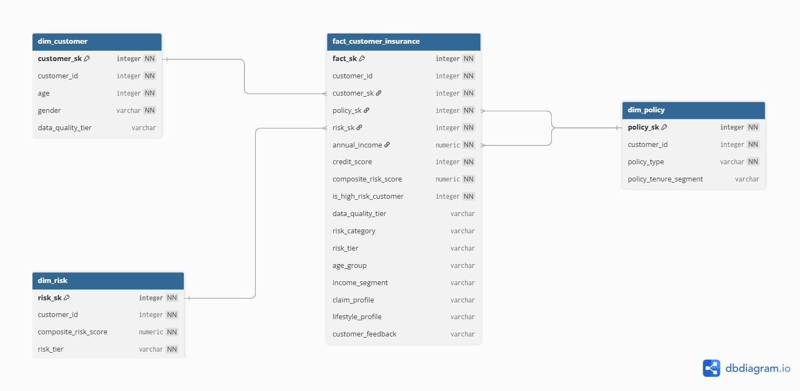

# dbt Insurance Project — Documentation

> This is the **dbt transformation layer**.  
> NiFi handles ingestion, while dbt is responsible for **data modeling, transformation, and analytics layers**.

---

## File Structure

```

dbt/
├── models/
│   ├── bronze/
│   │   └── insurance_bronze.sql
│   ├── silver/
│   │   └── insurance_silver.sql
│   └── gold/
│       ├── dim_customer.sql
│       ├── dim_policy.sql
│       ├── dim_risk.sql
│       └── fact_customer_insurance.sql
│
├── snapshots/
│   └── insurance_silver_snapshot.sql
│
├── analyses/
│   ├── customer_risk_distribution.sql
│   ├── imputation_impact.sql
│   └── ltv_and_premium_analysis.sql
│
├── macros/
│   └── insurance_macros.sql
│
└── tests/
    └── schema_tests.yml

```

---

## Data Architecture Overview

### End-to-End Data Flow

> From ingestion → transformation → analytics modeling

 

---

## Analytics Overview

### Customer Risk Distribution

This analysis shows how customers are distributed across risk tiers.



---

### LTV & Premium Analysis

Shows relationship between:
- Customer Lifetime Value (LTV)
- Monthly premium
- Income segments



---

### Data Quality & Imputation Impact

Evaluates how imputation affects:
- income
- credit score
- overall data quality tiers



---

## Data Layers Overview

### Bronze Layer (Raw Cleaning Layer)
- Raw standardized dataset from NiFi ingestion
- Handles:
  - NULL imputation (mean / median / mode)
  - Data type casting
  - Basic validation
- Adds imputation tracking flags

---

### Silver Layer (Business Logic Layer)
- Business transformations & feature engineering:
  - Age grouping
  - Income segmentation
  - Risk classification
  - Lifestyle profiling
  - Claim behavior profiling

---

### Gold Layer (Analytics Layer)

Star schema for analytics:

**Dimensions**
- Customer demographics
- Policy attributes
- Risk scoring

**Fact Table**
- Income, credit score, claims
- Composite risk score
- LTV proxy
- Estimated premium
- Behavioral segments

---

## Analyses Layer (Ad-hoc Queries)

| File | Purpose |
|------|--------|
| `customer_risk_distribution.sql` | Risk segmentation across customers |
| `imputation_impact.sql` | Impact of missing data handling |
| `ltv_and_premium_analysis.sql` | Revenue & customer value insights |

---

## Macros (Reusable Logic Layer)

- `safe_divide` → prevents division by zero
- `composite_risk_score` → weighted risk engine

---

## Physical Data Model — Data Dictionary


---

## DIM CUSTOMER

| Column | Type | Description |
|--------|------|-------------|
| customer_sk | integer | Surrogate key |
| customer_id | integer | Business ID |
| age | integer | Cleaned customer age |
| gender | varchar | Gender |
| data_quality_tier | varchar | Completeness level |

---

## DIM POLICY

| Column | Type | Description |
|--------|------|-------------|
| policy_sk | integer | Surrogate key |
| customer_id | integer | Business ID |
| policy_type | varchar | Policy type |
| policy_tenure_segment | varchar | Duration category |

---

## DIM RISK

| Column | Type | Description |
|--------|------|-------------|
| risk_sk | integer | Surrogate key |
| customer_id | integer | Business ID |
| composite_risk_score | numeric | Weighted risk score |
| risk_tier | varchar | Risk classification |

---

## FACT CUSTOMER INSURANCE

| Column | Type | Description |
|--------|------|-------------|
| fact_sk | integer | Surrogate key |
| customer_id | integer | Business ID |
| customer_sk | integer | FK |
| policy_sk | integer | FK |
| risk_sk | integer | FK |

### Financial Measures

| Column | Type | Description |
|--------|------|-------------|
| annual_income | numeric | Income |
| credit_score | integer | Credit rating |
| composite_risk_score | numeric | Final risk score |
| is_high_risk_customer | integer | Risk flag |

---

### Behavioral Features

| Column | Description |
|--------|-------------|
| age_group | Age segmentation |
| income_segment | Income segmentation |
| claim_profile | Claim behavior |
| lifestyle_profile | Lifestyle classification |
| customer_feedback | Feedback category |

---

## 🔗 Relationship Summary

- `dim_customer` → customer profile
- `dim_policy` → policy attributes
- `dim_risk` → risk engine output
- `fact_customer_insurance` → central analytics table
```

---
 