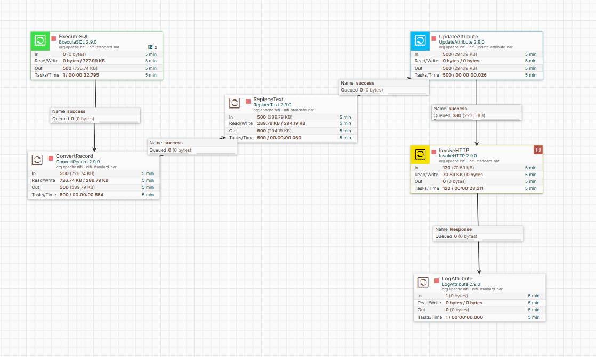
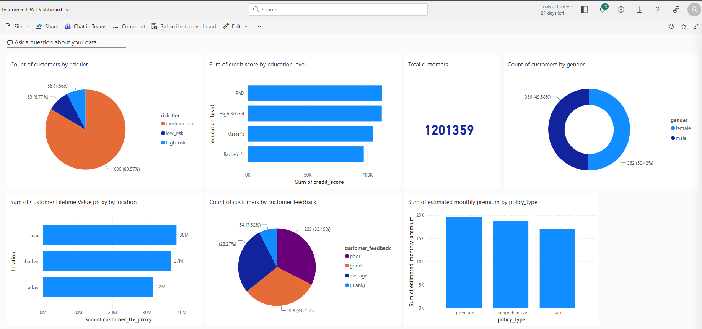

# Distribution Pipeline: NiFi to Power BI

## Overview

This component implements the **Distribution** requirement of the Data Warehouse project:

> NiFi picks up the final, polished data from the warehouse and distributes it to Power BI to avoid manual Power BI refreshes.

It also fulfills the **bonus requirement**:


The pipeline reads the gold-layer fact table from PostgreSQL and pushes it automatically to a Power BI streaming dataset using the Power BI REST API, eliminating any need for manual data refresh.

---

## Pipeline Architecture

```
PostgreSQL (raw_gold.fact_customer_insurance)
        |
        v
  [ ExecuteSQL ]
        |
        v
  [ ConvertRecord ]
        |
        v
  [ ReplaceText ]
        |
        v
  [ UpdateAttribute ]
        |
        v
  [ InvokeHTTP ] -----> Power BI Push Dataset API
        |
        v
  [ LogAttribute ]
```

---

## NiFi Flow Screenshot



---

## Processor Details

### 1. ExecuteSQL

**Purpose:** Connects to the PostgreSQL data warehouse and executes a SQL query against the gold layer fact table.

**Key Configuration:**

| Property | Value |
|----------|-------|
| SQL Query | `SELECT * FROM raw_gold.fact_customer_insurance LIMIT 500` |
| Max Rows Per FlowFile | 500 |
| Output Batch Size | 500 |
| Fetch Size | 500 |
| Database Connection Pooling Service | DBCPConnectionPool |

**Why:** The gold layer fact table `fact_customer_insurance` contains the final, cleaned, and modeled data produced by dbt. It is the single source of truth for the dashboard. The LIMIT 500 per batch prevents OutOfMemoryError on the NiFi JVM and respects Power BI API rate limits (HTTP 429).

**Output format:** Apache Avro (default ExecuteSQL output format).

---

### 2. ConvertRecord

**Purpose:** Converts the Avro-encoded FlowFile produced by ExecuteSQL into JSON format.

**Key Configuration:**

| Property | Value |
|----------|-------|
| Record Reader | AvroReader |
| Record Writer | JsonRecordSetWriter |
| Output Grouping | output-array |

**Why:** Power BI REST API expects a JSON payload. ExecuteSQL natively outputs Avro, so ConvertRecord bridges the format gap using the AvroReader and JsonRecordSetWriter controller services. The `output-array` grouping wraps all records in a JSON array `[{...}, {...}]`.

---

### 3. ReplaceText

**Purpose:** Wraps the JSON array in the `{"rows": [...]}` structure required by the Power BI Push Dataset API.

**Key Configuration:**

| Property | Value |
|----------|-------|
| Search Value | `(\[[\s\S]*\])` |
| Replacement Value | `{"rows":$1}` |
| Evaluation Mode | Entire text |
| Maximum Buffer Size | 200 MB |

**Why:** The Power BI REST API endpoint `/datasets/{id}/rows` requires the request body to follow this exact structure:

```json
{
  "rows": [
    { "column1": "value1", ... },
    { "column2": "value2", ... }
  ]
}
```

Without this wrapper, Power BI returns HTTP 400 Bad Request.

---

### 4. UpdateAttribute

**Purpose:** Sets the `mime.type` attribute to `application/json` on the FlowFile.

**Key Configuration:**

| Property | Value |
|----------|-------|
| mime.type | application/json |

**Why:** The InvokeHTTP processor reads the `mime.type` attribute to set the `Content-Type` HTTP header. Power BI API requires `Content-Type: application/json` on all POST requests, otherwise it rejects the payload.

---

### 5. InvokeHTTP

**Purpose:** Sends the JSON payload to the Power BI Push Dataset REST API via HTTP POST.

**Key Configuration:**

| Property | Value |
|----------|-------|
| HTTP Method | POST |
| HTTP URL | Power BI Push Dataset URL |
| Request Content-Type | application/json |
| Request Body Enabled | true |
| Response Generation Required | true |

**Why:** This is the core distribution mechanism. The Power BI Push Dataset API accepts real-time data pushes without requiring manual refresh. Once NiFi sends a POST request with the correct payload, the data appears immediately in the Power BI dataset and any connected dashboards update automatically.

The scheduling is set to run periodically (every 5 minutes or on a cron schedule) to keep the dashboard data fresh without human intervention.

**HTTP 429 Handling:** Power BI enforces rate limits on push dataset API calls. If the pipeline runs too frequently, Power BI returns HTTP 429 Too Many Requests with a `retry-after` header. The scheduling interval is configured to respect this limit.

---

### 6. LogAttribute

**Purpose:** Logs the HTTP response from Power BI for monitoring and debugging.

**Why:** Connected to the Response relationship of InvokeHTTP to capture the API response status (HTTP 200 OK on success, or error messages on failure). This enables observability without stopping the pipeline.

---

## Controller Services

### DBCPConnectionPool

Manages the JDBC connection pool to PostgreSQL.

| Property | Value |
|----------|-------|
| Database Connection URL | `jdbc:postgresql://postgres:5432/insurance_dw` |
| Database Driver Class Name | `org.postgresql.Driver` |
| Database User | admin |

### AvroReader

Reads the Avro-encoded output from ExecuteSQL using the schema embedded in the Avro file itself (`embedded-avro-schema` strategy).

### JsonRecordSetWriter

Serializes records as a JSON array. Schema is inherited from the incoming record schema. Null values are never suppressed to maintain schema consistency with the Power BI dataset column definitions.

---

## Power BI Dataset

The target is a **Push Dataset** created in Power BI online under the Insurance DW Project workspace.

| Dataset Name | fact_customer_insurance |
|---|---|
| Type | Push Dataset (API) |
| Historic data analysis | Enabled |
| Refresh mechanism | Real-time push via NiFi |

### Dataset Columns

| Column | Type |
|--------|------|
| customer_id | Number |
| annual_income | Text |
| credit_score | Number |
| vehicle_age | Number |
| insurance_duration | Number |
| previous_claims | Number |
| health_score | Text |
| composite_risk_score | Text |
| estimated_monthly_premium | Text |
| customer_ltv_proxy | Text |
| risk_tier | Text |
| age_group | Text |
| gender | Text |
| location | Text |
| policy_type | Text |
| income_segment | Text |
| education_level | Text |
| occupation | Text |
| marital_status | Text |
| customer_feedback | Text |
| data_quality_tier | Text |
| claim_profile | Text |
| risk_category | Text |

---

## Power BI Dashboard

The Insurance DW Dashboard visualizes the pushed data across multiple charts and KPIs.



### Visuals

| Visual | Type | Fields |
|--------|------|--------|
| Total Customers | Card | COUNT(customer_id) |
| Customers by Risk Tier | Pie Chart | risk_tier, COUNT(customer_id) |
| Credit Score by Education Level | Bar Chart | education_level, SUM(credit_score) |
| Customers by Gender | Donut Chart | gender, COUNT(customer_id) |
| Customer LTV by Location | Bar Chart | location, SUM(customer_ltv_proxy) |
| Customers by Feedback | Pie Chart | customer_feedback, COUNT(customer_id) |
| Premium by Policy Type | Column Chart | policy_type, SUM(estimated_monthly_premium) |

---

## Why This Approach

Manual Power BI refresh requires a user to log in and trigger a refresh every time the data changes. This is not viable for a live data warehouse. The NiFi InvokeHTTP approach:

- Pushes data automatically on a schedule
- Requires no human intervention
- Updates the dashboard in real time
- Integrates directly into the existing NiFi orchestration pipeline
- Leverages the Power BI Push Dataset API which is designed exactly for this use case
