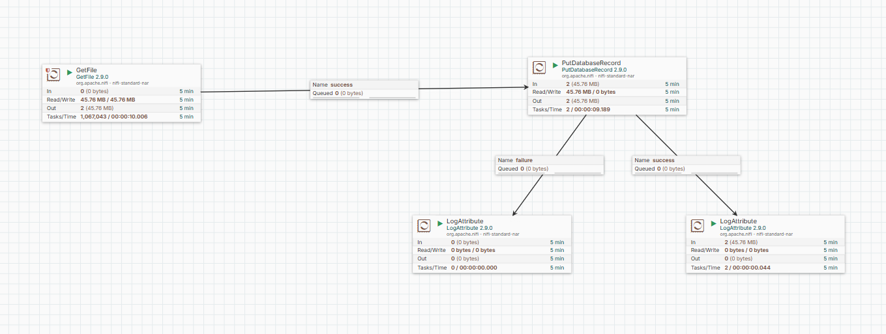
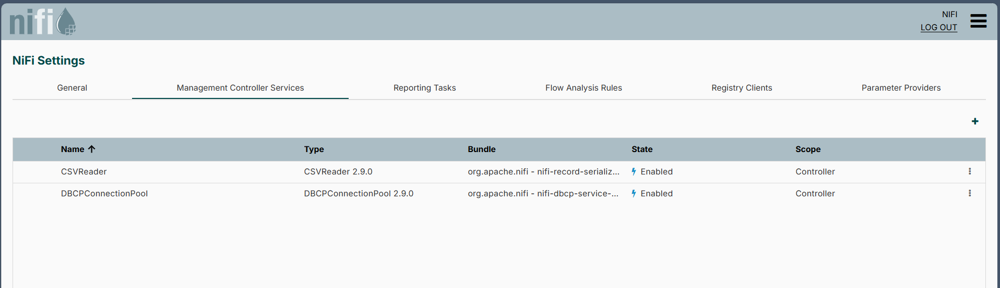
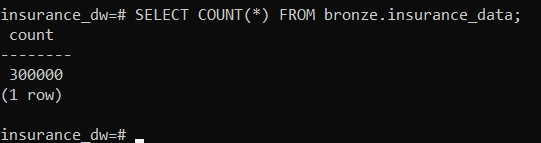

# Data Ingestion Pipeline (NiFi)

## Overview

This pipeline is responsible for ingesting raw insurance data from CSV files and loading it into the Bronze layer in PostgreSQL.

It is built using Apache NiFi and represents the **data ingestion layer** in the overall data warehouse architecture.

---

## Architecture

The ingestion flow follows a streamlined pattern:

GetFile → PutDatabaseRecord → Logging

- Files are ingested from a local directory
- Data is parsed using a CSVReader (infer schema)
- Records are inserted directly into PostgreSQL

---

## Flow Overview



This diagram shows the full NiFi pipeline, including:
- File ingestion
- Database loading
- Success and failure handling

---

## Components

### 1. GetFile

- Reads CSV files from a local directory
- Configured with batch processing
- Acts as the ingestion entry point

---

### 2. PutDatabaseRecord

- Inserts records into PostgreSQL
- Uses a DBCPConnectionPool controller service
- Handles batch inserts for performance

**Target:**
- Schema: `bronze`
- Table: `insurance_data`

---

### 3. Logging (LogAttribute)

- Captures:
  - Success events
  - Failure events
- Helps with debugging and monitoring the pipeline

---

## Controller Services



The pipeline uses:

- **DBCPConnectionPool**
  - Manages database connections
- **CSVReader**
  - Infers schema from CSV input

---

## Output

Data is stored in:

- **Database:** `insurance_dw`
- **Schema:** `bronze`
- **Table:** `insurance_data`

---

## Data Validation



A validation query confirms successful ingestion:

```sql
SELECT COUNT(*) FROM bronze.insurance_data;