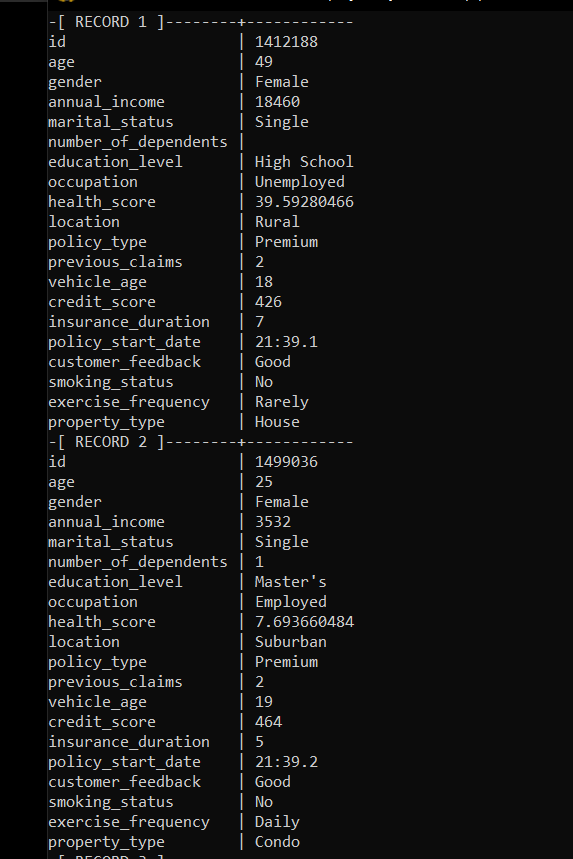

# NiFi Data Pipeline (Ingestion + Trigger + Distribution)

## Overview

This module implements the **Apache NiFi layer** in the data warehouse architecture.
It is responsible for three main responsibilities:

1. Data Ingestion into PostgreSQL (Bronze Layer)
2. Triggering Airflow DAGs for orchestration
3. Distributing processed data to Power BI using Push Dataset API

This demonstrates NiFi as a **central integration and automation engine** in the pipeline.

---

# 1. Data Ingestion Pipeline (CSV → PostgreSQL)

## Purpose

Ingest raw insurance CSV files into the Bronze layer of the warehouse.

---

## Flow

```text id="nifi_ing1"
GetFile → PutDatabaseRecord → LogAttribute
```

---

## Architecture


---

## Components

### GetFile

* Reads CSV files from local directory
* Supports batch ingestion

### PutDatabaseRecord

* Loads data into PostgreSQL
* Uses DBCPConnectionPool
* Target: `bronze.insurance_data`

### LogAttribute

* Logs success/failure events for monitoring

---

## Output

* Database: `insurance_dw`
* Schema: `bronze`
* Table: `insurance_data`

---

## Validation




---

# 2. Orchestration Trigger (NiFi → Airflow)

## Purpose

NiFi triggers Airflow DAG execution via REST API.

---

## Flow

```text id="nifi_ing2"
GenerateFlowFile → UpdateAttribute → InvokeHTTP → LogAttribute
```

---

## Airflow Trigger Endpoint

```text id="nifi_ing3"
POST /api/v1/dags/{dag_id}/dagRuns
```

---

## Payload Example

```json id="nifi_ing4"
{
  "conf": {
    "triggered_by": "nifi"
  }
}
```

---

## Schedule

* Airflow DAG runs every 1 minute
* Enables near real-time orchestration

---

## Screenshots

### NiFi Triggering Airflow


### Airflow Execution Result


---

# 3. Data Distribution (NiFi → Power BI)

## Purpose

NiFi extracts final transformed data from the warehouse and pushes it directly to Power BI using the **Push Dataset API**, eliminating manual refresh.

---

## Flow

```text id="nifi_ing5"
ExecuteSQL → ConvertRecord → ReplaceText → UpdateAttribute → InvokeHTTP → LogAttribute
```

---

## Architecture


---

## Key Processing Steps

### ExecuteSQL

* Reads gold layer table:

  * `raw_gold.fact_customer_insurance`

### ConvertRecord

* Converts Avro → JSON

### ReplaceText

* Wraps payload into Power BI format:

```json id="nifi_ing6"
{ "rows": [...] }
```

### UpdateAttribute

* Sets `mime.type = application/json`

### InvokeHTTP

* Sends data to Power BI Push Dataset API

---

## Power BI Output


---

## Key Benefit

* Eliminates manual Power BI refresh
* Enables automated dashboard updates
* Supports near real-time reporting

---

# NiFi Controller Services

### DBCPConnectionPool

* Manages PostgreSQL connections

### AvroReader

* Reads ExecuteSQL output schema

### JsonRecordSetWriter

* Converts records into JSON format for API consumption

---

# Key Role of NiFi in This Project

NiFi acts as a **central data orchestration and integration layer**:

* Ingests raw data into the warehouse
* Triggers external orchestration (Airflow)
* Pushes final data to analytics tools (Power BI)

This demonstrates NiFi as a **data movement + automation engine** in a modern data architecture.

---
 